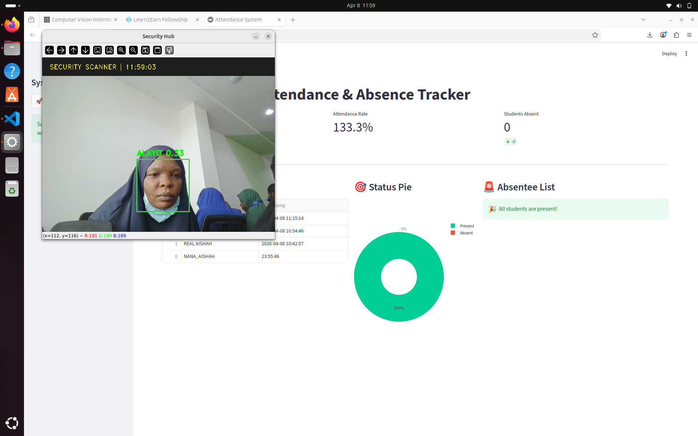

# Attendance System
**Final Internship Project | Computer Vision & Deep Learning**

## Project Overview
An automated attendance management system using Facial Recognition to identify authorized users and log presence in real time. Features include a security auto-shutdown for unauthorized access and a live analytics dashboard.

## Key Features
- **Dynamic Database:** Automatically encodes students from the `Training_Images` folder.
- **Biometric Logic:** 128-dimensional facial encoding using ResNet-34.
- **Security Hub:** High-Tech HUD with a 5-second "Unknown User" auto-shutdown.
- **Voice UX:** Automated greetings using `pyttsx3` text to speech.
- **Analytics Dashboard:** Real time Streamlit portal with attendance rates and absentee lists.

## The Mathematics & Logic
### 1. Face Detection (HOG)
The system uses **Histogram of Oriented Gradients** to find faces. It ignores color and looks at light gradients to detect facial structures, making it robust against lighting changes.

### 2. Landmark Alignment
The AI identifies **68 specific facial landmarks**. It uses **Linear Algebra (Affine Transformations)** to rotate the face so eyes and mouth are perfectly aligned for a fair comparison.

### 3. Face Encoding (128-D Vector)
A Deep Neural Network measures unique features (eye distance, nose width, etc.) and converts the face into a **Vector of 128 numbers**.

### 4. Identity Verification (Euclidean Distance)
Recognition is determined by calculating the **Euclidean Distance** between the live face and the database.
- **Formula:** $d = \sqrt{\sum (V_{photo} - V_{live})^2}$
- **Threshold:** Set to **0.45**. If $d < 0.45$, access is granted.

## Project Previews
### Biometric Scanner and Management Dashboad

## Tech Stack
- **Language:** Python 3.12
- **Libraries:** OpenCV, Dlib, Face_Recognition, Pandas, Streamlit, Plotly.
- **OS:** Ubuntu 24.04 (Linux)